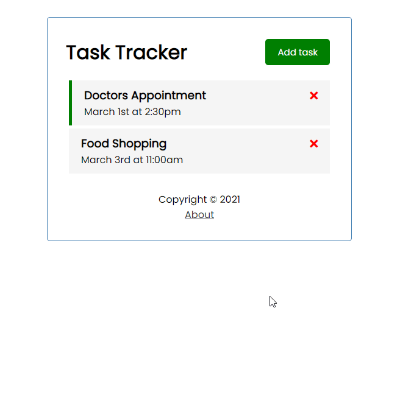

# Vue.Js Task Tracker
## Description: 
The simple app made using Vue.Js v.3 with router and JSON server in order to explore Vue.JS v.3

## The outcome: 
[](https://github.com/vladimir-bogomolov/vue-task-tracker)

## The Stack: 
The page built with **HTML, CSS and JavaScript**.
Used Vue CLI, Vue v.3, json-server, vue-router

## The version: 
Completed

## Project setup
```
npm install
```
### Starts local JSON server
```
npm run backend
```

### Compiles and hot-reloads for development
```
npm run serve
```

### Compiles and minifies for production
```
npm run build
```
